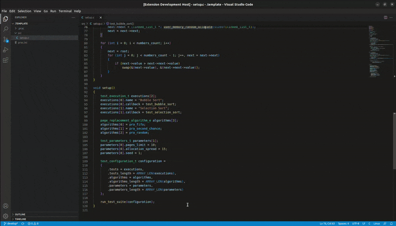

# PRAC Extension

This extension supplements the [framework for comparing page replacement algorithms](https://github.com/vbieleny/page-algorithm-comparison).

## Features

With this extension you can build, run and analyze your existing PRAC project.



Just open your PRAC project and the extension will be automatically activated. Then use commands in the command palette to build, run or analyze your project. All commands start with the prefix `PRAC`.

## Installation

To install this extension, download the [latest release]() from the [releases page](). Then you can either install it inside VS Code, or by using a terminal.

### Installing from Visual Studio Code

To install this extension from VS Code, go to `Extensions -> ... -> Install from VSIX...` and choose the downloaded extension.

### Installing from comand line

To install via command line, just execute this command:

```shell
code --install-extension path/to/extension.vsix
```

## Release Notes


### 1.0.0

Initial release of PRAC extension that supports building, cleaning, running and analyzing project.

# License
Distributed under the MIT License. See LICENSE.txt for more information.
